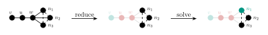

# red2pack v2.0.0

<p align="center">
  <a href="https://github.com/KarlsruheMIS/red2pack/actions"></a>
  <a href="https://opensource.org/licenses/MIT"></a>
  <a href="https://isocpp.org/"></a>
  <a href="https://cmake.org/"></a>
  <a href="https://github.com/KarlsruheMIS/red2pack"></a>
  <a href="https://github.com/KarlsruheMIS/red2pack"></a>
  <a href="https://github.com/KarlsruheMIS/red2pack/stargazers"></a>
  <a href="https://github.com/KarlsruheMIS/red2pack/issues"></a>
  <a href="https://github.com/KarlsruheMIS/red2pack/commits"></a>
  <a href="https://arxiv.org/abs/2308.15515"></a>
  <a href="https://doi.org/10.7155/jgaa.v29i1.3064"></a>
  <a href="https://arxiv.org/abs/2502.12856"></a>
  <a href="https://doi.org/10.1002/net.70028"></a>
  <a href="https://www.uni-heidelberg.de"></a>
</p>

<p align="center">  
    
</p> 

## Description
A 2-packing set for an undirected graph $G=(V,E)$ is a subset $S \subseteq V$ such that any two  
vertices $v_1,v_2 \in S$ have no common neighbors. 
Finding a 2-packing set of maximum cardinality is an NP-hard problem. 
This problem can be generalized for vertex-weighted graphs $G=(V,E,\omega)$, where each vertex is assigned a weight given by $\omega$.
Then it may be of interest to find a 2-packing set of maximum weight (sum of weights).
This project provides exact and heuristic solvers for the maximum (weight) 2-packing set problem.  
They exhaustively apply novel maximum (weight) 2-packing set (M(W)2S) data reductions in a preprocessing step and transform the reduced graph to an equivalent maximum (weight) independent set (M(W)IS) problem instance.  
This is joint work by Jannick Borowitz, Ernestine Großmann, Christian Schulz, and Dominik Schweisgut.

<p align="center">  
    
</p>

The figure shows an example where a vertex $v$ is included and its neighbors and distance-two-neighbors are excluded. To maintain the correct distance-two-neighborhood information throughout the reduction process, we insert so-called links (dashed lines).
Once the reduction process has finished, the reduced graph is transformed into an M(W)IS problem where an M(W)IS corresponds to an M(W)2PS in the reduced graph.
 
## 🎉 Version 2.0.0: Major Changes
- We updated KaMIS (dependency) to KaMIS version 3.0.0. KaMIS version 3.0.0 removes some memory leaks in the static graph class and provides new maximum weight independent set solvers such as $\texttt{m}^2\text{wis(+s)}$ which is used in our reduce-and-transform scheme. The forked version adds the ability to query the running time of the weighted branch-and-reduce solver for finding the best solution.
- Added solvers for MW2S (for more details see paper [^redw2pack] [^redw2packJournal].
- Restructured the CMake project and libraries for a more simple integration in new projects
- Renamed [unweighted reduction styles](#unweighted-reduction-styles) (core $\to$ main, elaborated $\to$ strong) 
- Renamed "2-edges" into "links" 
## Dependencies
To compile and initialize the build environment, please make sure you have the following dependencies installed:
- gcc (g++) 13.1.0 or newer
- CMake 3.16.0 or newer
- OpenMP (required by the CHILS library)
- SCIP ILP 9.0.0 or newer for ILP-based solvers (optional, see below)
## Setup
First of all, you need to clone this project. Then you can download the dependencies by cloning them as submodules. Both can be done as follows:
```shell  
git clone git@github.com:KarlsruheMIS/red2pack.git
cd red2pack
git submodule update --init --recursive
```

## Build (Linux/macOS)
The easiest way to build and install all solvers into `red2pack/deploy` is to run:
```shell
./compile_with_cmake.sh Release # or `Debug'
```
Or you can build with CMake specific targets and set additional CMake options:
```shell
# add -DRED2PACK_BUILD_ILP_SOLVERS=ON to enable ILP-based solvers
cmake -DCMAKE_BUILD_TYPE=Release -S . -B build # or `Debug' instead of `Release'
cmake -B build --target redw2pack_rnt_exact # or another target
```

## Run and benchmark
For each solver, an executable is installed. 
They allow you to benchmark our algorithms for the weighted and unweighted 2-packing set problems.

**Input**: The solvers support different reduction styles which can be set via `--reduction_style`.
You can run our solvers with different random seeds (`--seed`) for a specific time limit (`--time_limit` in seconds). 
If the time limit is reached, the best solution found so far is returned. 
To see all option, simply append `--help` when calling an algorithm.

**Output**: The logging output is written to the standard output. 
Once the solver finishes, the solution size (weight) is written together with the time required to find the best solution and the overall running time. 
The final 2-packing set can be written to a separate file `<file>` with `--output=<file>`.

For our weighted solvers and reduce algorithms, we provide some benchmark scripts in `benchmark/`.

#### Example

```shell
graph="path/to/example.graph"
log_dir="/some/logging/dir"
graphname=$(basename $graph)

# example: find optimal MW2PS for some graph and print solution to a file;
# if time limit is reached: the best solution found so far is returned
./redw2pack_rnt_exact --reduction_style=strong \
	--time_limit="$((4*60*60))" \ # 4 hours
	--seed=0 \
	--output="${log_dir}/${graphname}_sol.txt" \ # 2ps
	> "${log_dir}/${graphname}.log"

# example: Apply weight 2-packing set reductions and write reduced and transformed graph (MWIS problem) to a file
./redw2pack_reduce --reduction_style=strong \
	--output_rnt_graph="${log_dir}/${graphname}_reduced.graph"
	> "${log_dir}/${graphname}_reduce.log"
```
### Maximum 2-Packing Set Problem (Unweighted)
For a full description of our solvers, reduction styles and the details of the data reduction rules, take a look at our journal article[^red2packJournal] or preprint[^red2pack].
#### Unweighted Solvers

| Executable                   | Name               | Description                                                                  | 
| ---------------------------- | ------------------ | ---------------------------------------------------------------------------- | 
| `red2pack_branch_and_reduce` | red2pack-exact     | exact RnT; solves MIS problem with weighted B&R from KaMIS                   | 
| `red2pack_heuristic`         | red2pack-heuristic | heuristic solver; solves MIS problem heuristically with OnlineMIS from KaMIS | 
#### Unweighted Reduction Styles

| Reduction Style | Description                                              | Reduction List (processed in this order)                                          |
| --------------- | -------------------------------------------------------- | --------------------------------------------------------------------------------- |
| `main`          | applies clique and domination exhaustively               | `d2_simplicial`, `domination`                                                        |
| `fast`          | applies all unweighted data reduction rules exhaustively | `degree_one`, `degree_two`, `twin`, `fast_domination`, `domination`, `d2_simplicial` |

### Maximum Weight 2-Packing Set Problem
For a full description of our solvers, the reduction styles and the details of the data reduction rules, take a look at our journal article[^redw2packJournal] or preprint[^redw2pack].

#### Weighted Solvers

| Executable            | Name          | Description                                                                               | 
| --------------------- | ------------- | ----------------------------------------------------------------------------------------- | 
| `redw2pack_rnt_exact` | RnT-KaMIS-b&r | exact RnT; solves MWIS problem with weighted B&R from                                     | 
| `redw2pack_drp`       | DRP           | heuristic; combined iterative reduce-and-peel with difference-core technique (from CHILS) | 
| `redw2pack_rnt_htwis`     | RnT-HtWIS     | heuristic; solves MWIS problem with reduce-and-peel solver HtWIS                          | 
| `redw2pack_rnt_hils`      | RnT-HILS      | heuristic; solves MWIS problem with iterative local-search solver HILS                    | 
| `redw2pack_rnt_chils`     | RnT-CHILS     | heuristic; solved MWIS problem with CHILS                                                 | 
| `redw2pack_rnt_mmwis`     | RnT-mmwis     | heuristic; solves MWIS problem with advanced mimetic MWIS solver m$^2$wis+s               | 
| `redw2pack_rnt_scip_ilp` | RnT-SCIP | exact RNT; solves MWIS problem with SCIP ILP solver | 
| `redw2pack_scip_ilp`| SCIP_ILP | exact; solves MW2PS problem with SCIP ILP solver | 
#### Plain Reduce-And-Transform
If you are interested in applying our 2-packing set reductions — either to benchmark them or to obtain the reduced graph transformed into an MWIS problem — use the `redw2pack_reduce` executable. If you wish, you can compare the results against a plain transformation (without applying the 2-packing set reduction). To do so, use the `redw2pack_transform` executable. Given a graph it, simply constructs and stores all  neighborhoods of distance two (and then outputs the transformed graph to a file).
#### Weighted Reduction Styles

| Reduction Style | Description                                                          | Reduction List (processed in this order)                               |
| --------------- | -------------------------------------------------------------------- | ---------------------------------------------------------------------- |
| `fast`          | applies our efficient fast reductions once                           | `fast_degree_one`, `fast_degree_two`, `fast_neighborhood_removal`      |
| `main`          | applies our core data reduction rules exhaustively                   | `neighborhood_removal`, `domination`, `d2_simplicial_weight_transfer`, `split_intersection`, `split_neighbor`, `neighborhood_folding` |
| `strong`        | first applies `fast`, then applies `main` without using `domination` | `fast` + (`main` without `domination`)                                 |
| `full`          | applies `fast` and then  `main`                                      | `fast` + `main`                                                        |


## How to use our reduction pack `red2pack` as a subroutine
If you want to use our reduction pack `red2pack` as a subroutine, e.g., you want to build your own M(W)2S solver, then the following tutorial will help you.

1. Start a new CMake project,
2. Add `red2pack` as a recursive submodule
3. Start a new class for your solver that inherits from `red2pack/lib/rnt_solver_scheme.h` and implement `solve_mis`, which solves the MIS problem. The method `solve_mis` provides the reduced graph. You can transform it to an instance of your graph and then apply your M(W)IS solver. Make sure to represent 2-edges (links) as additional edges when transforming the problem to the M(W)IS problem.
4. Add a main function that calls your solver (similar to `/app/exact/red2pack_branch_and_reduce.cpp`).
5. Add the following in your CMakeLists.txt and adapt it to your setup
```cmake
# CMakeLists.txt
set(RED2PACK_ENABLE_APPS OFF)
set(RED2PACK_ENABLE_TESTS OFF)
set(RED2PACK_ENABLE_EXAMPLES OFF)
set(RED2PACK_USE_MALLOC_COUNT OFF)
set(RED2PACK_64BITS_MODE OFF) # depends on your needs
add_subdirectory(path/to/red2pack_repo)  
add_executable(solver solver.cpp)
target_link_libraries(solver PRIVATE red2pack::lib)
```

## License
The project is released under MIT License. However, some files from KaMIS are released under the BSD 3-clause license. See the respective files for their license. 
If you publish results using our algorithms, please acknowledge our work by citing one or more of the following papers:

For our solvers and reduction pack for the **unweighted** maximum 2-packing set problem, please cite:
```text
@article{DBLP:journals/jgaa/BorowitzG0S25,
  author       = {Jannick Borowitz and
                  Ernestine Gro{\ss}mann and
                  Christian Schulz and
                  Dominik Schweisgut},
  title        = {Scalable Algorithms for 2-Packing Sets on Arbitrary Graphs},
  journal      = {J. Graph Algorithms Appl.},
  volume       = {29},
  number       = {1},
  pages        = {159--186},
  year         = {2025},
  url          = {https://doi.org/10.7155/jgaa.v29i1.3064},
  doi          = {10.7155/JGAA.V29I1.3064},
  timestamp    = {Mon, 02 Feb 2026 17:29:07 +0100},
  biburl       = {https://dblp.org/rec/journals/jgaa/BorowitzG0S25.bib},
  bibsource    = {dblp computer science bibliography, https://dblp.org}
}
```  

For our solvers and reduction pack for the maximum **weight** 2-packing set problem, please cite:
```
@article{https://doi.org/10.1002/net.70028,
    author = {Borowitz, Jannick and Großmann, Ernestine and Schulz, Christian},
    title = {Finding Maximum Weight 2-Packing Sets on Arbitrary Graphs},
    journal = {Networks},
    doi = {https://doi.org/10.1002/net.70028},
    url = {https://onlinelibrary.wiley.com/doi/abs/10.1002/net.70028},
    eprint = {https://onlinelibrary.wiley.com/doi/pdf/10.1002/net.70028},
}
```

If you use `red2pack_branch_and_reduce`, `redw2pack_rnt_exact`, or `drp` with the branch-and-reduce solver as core solver, please also cite the following work, as all these solvers use the weighted branch-and-reduce solver from KaMIS:
```text  
@inproceedings{DBLP:conf/alenex/Lamm0SWZ19,  
author    = {Sebastian Lamm and  
Christian Schulz and  
Darren Strash and  
Robert Williger and  
Huashuo Zhang},  
title     = {Exactly Solving the Maximum Weight Independent Set Problem on Large Real-World Graphs},  
booktitle = {Proceedings of the Twenty-First Workshop on Algorithm Engineering and Experiments, {ALENEX} 2019},  
pages     = {144--158},  
url       = {https://doi.org/10.1137/1.9781611975499.12},  
doi       = {10.1137/1.9781611975499.12},  
publisher = {{SIAM}},  
year      = {2019}  
}  
```  

If you use `red2pack_heuristic`, please also cite the following work, as we solve the MIS problem using OnlineMIS from KaMIS:
```text  
@inproceedings{DBLP:conf/wea/DahlumLS0SW16,
  author       = {Jakob Dahlum and
                  Sebastian Lamm and
                  Peter Sanders and
                  Christian Schulz and
                  Darren Strash and
                  Renato F. Werneck},
  editor       = {Andrew V. Goldberg and
                  Alexander S. Kulikov},
  title        = {Accelerating Local Search for the Maximum Independent Set Problem},
  booktitle    = {Experimental Algorithms - 15th International Symposium, {SEA} 2016,
                  St. Petersburg, Russia, June 5-8, 2016, Proceedings},
  series       = {Lecture Notes in Computer Science},
  volume       = {9685},
  pages        = {118--133},
  publisher    = {Springer},
  year         = {2016},
  url          = {https://doi.org/10.1007/978-3-319-38851-9\_9},
  doi          = {10.1007/978-3-319-38851-9\_9},
  timestamp    = {Fri, 27 Dec 2019 21:22:00 +0100},
  biburl       = {https://dblp.org/rec/conf/wea/DahlumLS0SW16.bib},
  bibsource    = {dblp computer science bibliography, https://dblp.org}
}
```

If you use `redw2pack_rnt_chils` or `drp`, please also cite the following work, as they use CHILS as subroutine:
```
@inproceedings{gromann_et_al:LIPIcs.SEA.2025.22,
  author       = {Gro{\ss}mann, Ernestine and 
                  Langedal, Kenneth and 
                  Schulz, Christian},
  title        = {Concurrent Iterated Local Search for the Maximum Weight Independent Set Problem},
  booktitle    = {23rd International Symposium on Experimental Algorithms (SEA 2025)},
  pages        = {22:1--22:18},
  series       = {Leibniz International Proceedings in Informatics (LIPIcs)},
  ISBN         = {978-3-95977-375-1},
  ISSN         = {1868-8969},
  year         = {2025},
  volume       = {338},
  editor       = {Mutzel, Petra and Prezza, Nicola},
  publisher    = {Schloss Dagstuhl -- Leibniz-Zentrum f{\"u}r Informatik},
  address      = {Dagstuhl, Germany},
  doi          = {10.4230/LIPIcs.SEA.2025.22}
}
```

If you use `redw2pack_rnt_mmwis`, please also cite the following work, as they use m$^2$wis+s to solve the MWIS problem:
```
@article{DBLP:journals/jgaa/GrossmannLSS24,
  author       = {Ernestine Gro{\ss}mann and
                  Sebastian Lamm and
                  Christian Schulz and
                  Darren Strash},
  title        = {Finding Near-Optimal Weight Independent Sets at Scale},
  journal      = {J. Graph Algorithms Appl.},
  volume       = {28},
  number       = {1},
  pages        = {439--473},
  year         = {2024},
  url          = {https://doi.org/10.7155/jgaa.v28i1.2997},
  doi          = {10.7155/JGAA.V28I1.2997},
  timestamp    = {Tue, 26 Nov 2024 17:22:28 +0100},
  biburl       = {https://dblp.org/rec/journals/jgaa/GrossmannLSS24.bib},
  bibsource    = {dblp computer science bibliography, https://dblp.org}
}
```

If you use `redw2pack_rnt_htwis`, please also cite the following work, as we solve the MWIS problem heuristically using HtWIS.
```
@inproceedings{DBLP:conf/kdd/GuZCP21,
  author       = {Jiewei Gu and
                  Weiguo Zheng and
                  Yuzheng Cai and
                  Peng Peng},
  editor       = {Feida Zhu and
                  Beng Chin Ooi and
                  Chunyan Miao},
  title        = {Towards Computing a Near-Maximum Weighted Independent Set on Massive
                  Graphs},
  booktitle    = {{KDD} '21: The 27th {ACM} {SIGKDD} Conference on Knowledge Discovery
                  and Data Mining, Virtual Event, Singapore, August 14-18, 2021},
  pages        = {467--477},
  publisher    = {{ACM}},
  year         = {2021},
  url          = {https://doi.org/10.1145/3447548.3467232},
  doi          = {10.1145/3447548.3467232},
  timestamp    = {Mon, 06 Sep 2021 16:42:14 +0200},
  biburl       = {https://dblp.org/rec/conf/kdd/GuZCP21.bib},
  bibsource    = {dblp computer science bibliography, https://dblp.org}
}
```

If you use `redw2pack_rnt_hils`, please also cite the following work, as we use HILS to solve the MWIS problem:
```
@article{DBLP:journals/ol/NogueiraPS18,
  author       = {Bruno C. S. Nogueira and
                  Rian G. S. Pinheiro and
                  Anand Subramanian},
  title        = {A hybrid iterated local search heuristic for the maximum weight independent
                  set problem},
  journal      = {Optim. Lett.},
  volume       = {12},
  number       = {3},
  pages        = {567--583},
  year         = {2018},
  url          = {https://doi.org/10.1007/s11590-017-1128-7},
  doi          = {10.1007/S11590-017-1128-7},
  timestamp    = {Mon, 26 Oct 2020 08:23:00 +0100},
  biburl       = {https://dblp.org/rec/journals/ol/NogueiraPS18.bib},
  bibsource    = {dblp computer science bibliography, https://dblp.org}
}
```

[^red2pack]: [Scalable Algorithms for 2-Packing Sets on Arbitrary Graphs](https://doi.org/10.48550/arXiv.2308.15515) (preprint)
[^red2packJournal]: [Scalable Algorithms for 2-Packing Sets on Arbitrary Graphs ](https://doi.org/10.7155/jgaa.v29i1.3064)
[^redw2pack]: [Finding Maximum Weight 2-Packing Sets on Arbitrary Graphs](https://doi.org/10.48550/arXiv.2502.12856) (preprint)
[^redw2packJournal]: [Finding Maximum Weight 2-Packing Sets on Arbitrary Graphs](https://doi.org/10.1002/net.70028)
