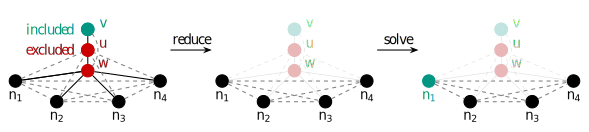

# red2pack 


## Description
This project provides a branch-and–reduce and heuristic solver for the maximum 2-packing set problem.
They apply exhaustively novel maximum 2-packing set (M2S) data reductions in a preprocessing step and transform the kernel to an equivalent maximum independent set (MIS) problem instance.
This is joint work between Jannick Borowitz, Ernestine Großmann, Christian Schulz, and Dominik Schweisgut.

## Dependencies
To compile and initialize the build environment, please make sure you have the following dependencies installed:
- GCC 13.1.0 or newer
- cmake 3.16 or newer

## Setup
First of all, you need to clone this project. Then you can download KaMIS by cloning it as a submodule:
```shell
git submodule update --init
```

## Build (Linux/MacOS)
We solve the MIS problem using the weighted branch-and-reduce (B&R) solver and OnlineMIS of KaMIS. 

In the case you want to run tests
- read [Testing](tests/README.md).

To build the executables, please run:
```shell
bash compile_withcmake.sh
```

The script builds the binaries in the `build` directory and installs the solvers in `deploy`.

## Run and benchmark
The following executables are installed and allow you to run and benchmark our algorithms:
- `red2pack_branch_and_reduce` using the weighted B&R solver from KaMIS
- `red2pack_heuristic` using OnlineMIS from KaMIS

Use `--help` for an overview of the options. Probably, the following script does all that you want:
```bash
# run heuristic:
./deploy/red2pack_heuristic tests/graphs/lesmis.graph --seed=0 --time_limit=100 

# run branch and reduce:
./deploy/red2pack_branch_and_reduce tests/graphs/lesmis.graph --seed=0 --time_limit=100
```

Note that the reduction style `core` disables all data reductions except for domination and clique.
Whereas `elaborated` uses all of them. It can be set with `--reduction_style` 

For further details about our data reductions, and further configurations we recommend reading [our paper](https://arxiv.org/abs/2308.15515).

## How to use our reduction pack `red2pack` as a subroutine 
If you want to use our reduction pack `red2pack` as a subroutine, e.g., you want to build your own M2S solver,
then the following tutorial will help you.

1. Start a new CMake project,
2. Install `red2pack` as a recursive submodule
3. Start a new class for your solver that inherits from `lib/solver_scheme.h` and implement `solve_mis` that solves the MIS problem.
4. Add a main function that calls your solver (similar to `/app/bnr/red2pack_branch_and_reduce.cpp`).
5. Add the following in your CMakeLists.txt and adapt it to your setup  
```cmake
include_directories(path/to/red2pack)
add_subdirectory(path/to/red2pack)
add_executable(solver solver.cpp $<TARGET_OBJECTS:libkaffpa2> $<TARGET_OBJECTS:libsources> $<TARGET_OBJECTS:libred2pack>)
```

## License 
The project is released under MIT. However, some files from KaMIS are released under the BSD 3-clause license. See the respective files for their license. If you publish results using our algorithms, please acknowledge our work by quoting one or more of the following papers:

For our reduction pack `red2pack` or one of our solvers, `red2pack_branch_and_reduce` or `red2pack_heuristic`, for the maximum 2-packing set problem,
please cite:
```text
@article{DBLP:journals/corr/abs-2308-15515,
  author       = {Jannick Borowitz and
                  Ernestine Gro{\ss}mann and
                  Christian Schulz and
                  Dominik Schweisgut},
  title        = {Finding Optimal 2-Packing Sets on Arbitrary Graphs at Scale},
  journal      = {CoRR},
  volume       = {abs/2308.15515},
  year         = {2023},
  url          = {https://doi.org/10.48550/arXiv.2308.15515},
  doi          = {10.48550/arXiv.2308.15515},
  eprinttype    = {arXiv},
  eprint       = {2308.15515},
  timestamp    = {Mon, 04 Sep 2023 15:29:24 +0200},
  biburl       = {https://dblp.org/rec/journals/corr/abs-2308-15515.bib},
  bibsource    = {dblp computer science bibliography, https://dblp.org}
}
```

If you use `red2pack_branch_and_reduce`, please also cite the following work as we solve the MIS problem using the weighted branch-and-reduce solver from KaMIS:
```text
@inproceedings{DBLP:conf/alenex/Lamm0SWZ19,
author    = {Sebastian Lamm and
Christian Schulz and
Darren Strash and
Robert Williger and
Huashuo Zhang},
title     = {Exactly Solving the Maximum Weight Independent Set Problem on Large Real-World Graphs},
booktitle = {Proceedings of the Twenty-First Workshop on Algorithm Engineering and Experiments, {ALENEX} 2019},
pages     = {144--158},
year      = {2019},
url       = {https://doi.org/10.1137/1.9781611975499.12},
doi       = {10.1137/1.9781611975499.12},
publisher = {{SIAM}},
year      = {2019}
}
```

If you use `red2pack_heuristic`, please also cite the following work as we solve the MIS problem using OnlineMIS from KaMIS:
```text
@inproceedings{DBLP:conf/wea/DahlumLS0SW16,
  author    = {Jakob Dahlum and
               Sebastian Lamm and
               Peter Sanders and
               Christian Schulz and
               Darren Strash and
               Renato F. Werneck},
  title     = {Accelerating Local Search for the Maximum Independent Set Problem},
  booktitle = {15th International Symposium on Experimental Algorithms {SEA}},
  pages     = {118--133},
  year      = {2016},
  series    = {Lecture Notes in Computer Science},
  volume    = {9685},
  publisher = {Springer},
  url       = {https://doi.org/10.1007/978-3-319-38851-9\_9}
}
```
